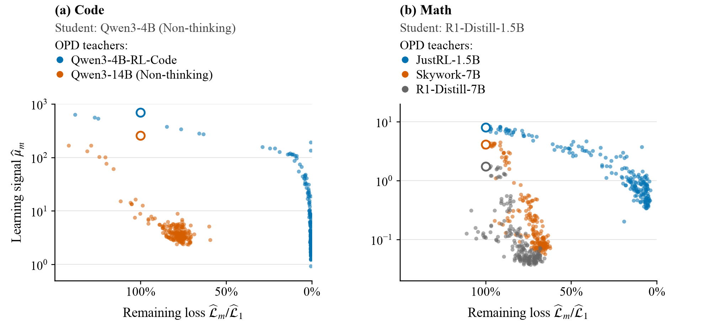
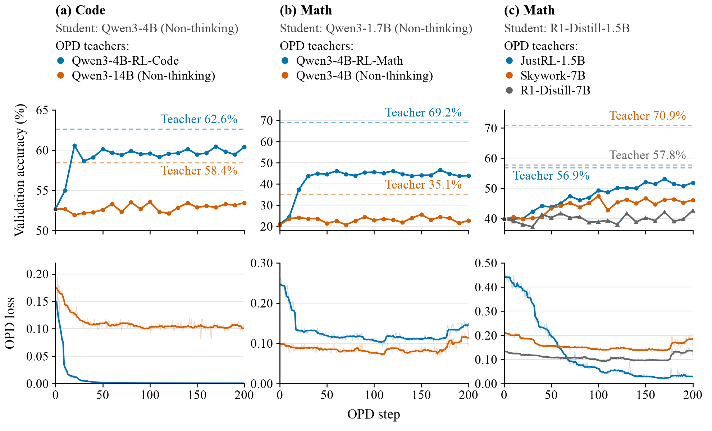

<div align="center">

<h1>Why On-Policy Distillation Sometimes Fails:<br>Vanishing Learning Signals</h1>

<p>
Lei Zhao<sup>1</sup> · Qichao Zhao<sup>2</sup> · Bowen Zuo<sup>3</sup> · Qishi Zhan<sup>4</sup>
</p>
<p>
<sup>1</sup>University of Pennsylvania &nbsp; <sup>2</sup>Tsinghua University<br>
<sup>3</sup>University of California, Riverside &nbsp; <sup>4</sup>Marquette University
</p>

<p>
<a href="#results">Results</a> &nbsp;•&nbsp;
<a href="#quick-start">Quick start</a> &nbsp;•&nbsp;
<a href="docs/EXPERIMENTS.md">Experiments</a> &nbsp;•&nbsp;
<a href="docs/REPRODUCIBILITY.md">Reproducibility</a> &nbsp;•&nbsp;
<a href="#citation">Citation</a>
</p>

</div>

**Why can distillation stall while the student still differs substantially from its teacher?** We study on-policy distillation (OPD) across code generation and mathematical reasoning, combining training diagnostics with a continuous-time analysis. This repository contains the training recipes, analysis tools, and numerical inputs for the paper's figures.

## Results

<a href="docs/assets/learning-signals.png">
  
</a>

*Figure 2 from the paper: learning-signal proxy versus remaining loss across five runs. Each point is one update; open circles mark step 1. Moving right means less loss remains, while moving down means a weaker proxy. Click the figure to enlarge.*

**Across all seven main runs**, the average final loss reductions after 200 updates are:

| Teacher group | Runs | Mean final loss reduction |
|:---|:---:|---:|
| Larger-scale teachers | 5 | **25.1%** |
| Self-RL teachers | 2 | **96.2%** |

Self-RL teachers are obtained by further RL training of the **same initial student**. The table reports the mean of each run's `(1 − loss_final / loss_start) × 100%` after 200 updates, using raw endpoints. These are descriptive results for the runs studied, not a controlled estimate of the effect of teacher size or initialization. [Numerical source →](paper/figures/data/teacher_recoverability_metrics.csv)

<details>
<summary>Full training curves and evaluation protocol — all seven runs</summary>



*Figure 1 from the paper. Top: student validation accuracy; bottom: OPD loss. Dashed lines mark standalone teacher accuracy.*

Loss curves use centered 9-step rolling medians, with raw per-step values shown faintly. Within each of panels (a) and (c), the teacher runs share a step-zero evaluation of that panel’s initial student, shown in black. Code reports avg@4; math reports macro-averaged avg@8 over AIME24, AIME25, and AMC23. The base Qwen3 models use non-thinking mode. See the [experiment map](docs/EXPERIMENTS.md) for the fixed four-of-eight Code evaluation protocol and run provenance.

Qwen3-4B-RL-Math is a **larger-scale** teacher for the Qwen3-1.7B student, even though it was RL-trained. “Self-RL” does not mean every teacher with RL in its name. Final loss reduction above differs from maximum loss reduction, which uses the lowest recorded loss.

</details>

## What we find

- **A recurring plateau.** In the larger-scale-teacher runs studied, loss reduction stalls while substantial teacher–student differences remain. Self-RL teachers support much greater loss reduction and improved validation accuracy.
- **A diagnostic view of learning.** We track gradient strength relative to the remaining loss and separate it from the effect of changing rollout distributions. The idealized flow relates loss decay to both quantities.
- **A local recovery guarantee.** For sufficiently nearby teachers in a shared parameterization, the theory bounds loss by an exponentially decaying term plus a residual under stated regularity conditions over a local time interval.

<details>
<summary><strong>How to read the learning-signal diagnostic</strong></summary>

The overview shows two students and five runs, with all 200 raw, unsmoothed updates per run. Remaining loss is normalized by each run's step-1 loss. The diagnostic contrasts signal reduction near low loss with signal reduction while substantial loss remains.

In the idealized continuous-time flow,

$\displaystyle \frac{d\mathcal L}{dt}=-2\mu(1+\alpha)\mathcal L,\qquad \mu=\frac{\lVert g\rVert^2}{2\mathcal L}.$

Here, $\mu$ measures gradient strength relative to remaining loss, and $\alpha$ measures whether changing rollout distributions reinforce or offset loss reduction. The plotted training-log proxy uses stochastic pre-clipping gradient norms: it includes sampling noise and is **not** an AdamW update norm. The identity alone does not establish why gradients become small or exclude a positive best-achievable loss. See [diagnostic definitions and scope](docs/REPRODUCIBILITY.md#rate-and-loss-conventions).

</details>

## Quick start

### Recreate the figures on CPU

```bash
git clone https://github.com/leizhao7/opd-learning-signals.git
cd opd-learning-signals
python3.12 -m venv .venv
source .venv/bin/activate
pip install -r requirements-analysis.txt
python -m opd figures
```

Plots are written under `paper/figures/`, using the committed numerical inputs. No model download or GPU is needed. To rebuild the learning-signal figures shown here, use `python -m opd figures --group signal`.

### Run an OPD experiment

Prepare the GPU environment and model/data checkpoints using the [installation guide](docs/INSTALL.md). Preview a launch with:

```bash
python -m opd train --recipe qwen_math \
  --student /models/Qwen3-1.7B --teacher /models/Qwen3-4B \
  --train-data /data/dapo-math-17k.parquet \
  --val-data /data/AIME24.parquet /data/AIME25.parquet /data/AMC23.parquet \
  --output /results/qwen-opd --name qwen17-qwen4
```

Add `--execute` to start training. Use `python -m opd recipes` to list all 11 recipes. Each executed launch saves its resolved configuration and backend in the output directory. Run commands from the repository root.

<details>
<summary>CPU checks and configuration overrides</summary>

```bash
pip install -r requirements-test.txt
# Install CPU PyTorch to include the full-logit value/gradient check.
pip install torch --index-url https://download.pytorch.org/whl/cpu
python -m unittest discover -s tests -v
```

Configuration precedence is **shared settings → recipe → CLI overrides**. For example, `--override trainer.total_training_steps=200` overrides the training horizon. Logging defaults to console. Choose one veRL snapshot at a time as described in the installation guide. The launchers do not allocate cluster resources automatically.

See the [organization guide](docs/ORGANIZATION.md) for all unified commands and extension rules, or the [CPU workflow](.github/workflows/checks.yml) for CI checks.

</details>

## Find your experiment

| Goal | Start here |
|:---|:---|
| Reproduce Code and Math OPD | [11 training recipes](configs/recipes/) · [experiment map](docs/EXPERIMENTS.md) |
| Compare top-16 / full-logit and rollout counts | [Ablation figures](paper/figures/ablations/support/) · [recipe provenance](docs/EXPERIMENTS.md) |
| Run SFT → OPD | [SFT setup](docs/INSTALL.md#sft) · [`sft_opd_qwen`](configs/recipes/sft_opd_qwen.json) · [`sft_opd_r1`](configs/recipes/sft_opd_r1.json) |
| Analyze learning signals and occupancy | [Signal analysis](analysis/learning_signal.py) · [definitions](docs/REPRODUCIBILITY.md#rate-and-loss-conventions) |
| Measure parameter changes and CKA | [Geometry tools](analysis/geometry/) · [example configuration](configs/geometry.example.json) |
| Audit Code avg@4 | [Evaluation audit](evaluation/audit_code_avg4.py) · [protocol](docs/EXPERIMENTS.md#important-measurement-distinctions) |

## Reproduction status

CPU figure reconstruction, numerical checks, and dry-run launchers have been verified. Full GPU retraining and all external evaluation dependencies have **not** been rerun from this package. The experiments use a fixed training horizon and do not establish that the observed plateaus persist under every training configuration.

<details>
<summary>Included artifacts and known gaps</summary>

- Included: training snapshots, portable launchers, evaluation/geometry utilities, audited plotting inputs, and [source hashes](provenance/).
- Models, training datasets, raw benchmark responses, and cluster orchestration are not bundled. Some recipes are reconstructed convenience launchers; the [experiment map](docs/EXPERIMENTS.md) labels their provenance.
- The standalone all-parameter occupancy measurement driver was not recovered. Recorded occupancy values and reanalysis tools are included; the supplementary suffix-gradient probe is not a replacement.
- The historical instruction-following protocol has training/evaluation source overlap; its results do not establish held-out generalization.
- Small parameter changes and high representation similarity are observations. Their role in causing signal collapse remains a hypothesis. The local theorem concerns an idealized flow and nearby teachers with shared parameterization.

Read the [reproduction notes](docs/REPRODUCIBILITY.md) before interpreting or extending these diagnostics.

</details>

## Citation

The manuscript is in preparation. Until a public paper identifier is available:

```bibtex
@unpublished{zhao2026opd,
  title  = {Why On-Policy Distillation Sometimes Fails: Vanishing Learning Signals},
  author = {Zhao, Lei and Zhao, Qichao and Zuo, Bowen and Zhan, Qishi},
  year   = {2026},
  note   = {Manuscript in preparation}
}
```

## Acknowledgments and license

The authors' original code is licensed under the [MIT License](LICENSE).

This work builds on the third-party projects preserved under [`vendor/`](vendor/), including veRL and LLaMA-Factory. Third-party components retain their original licenses and copyright notices; see [third-party notices](THIRD_PARTY.md).

Contact: [Lei Zhao](mailto:leizhao7@upenn.edu).
